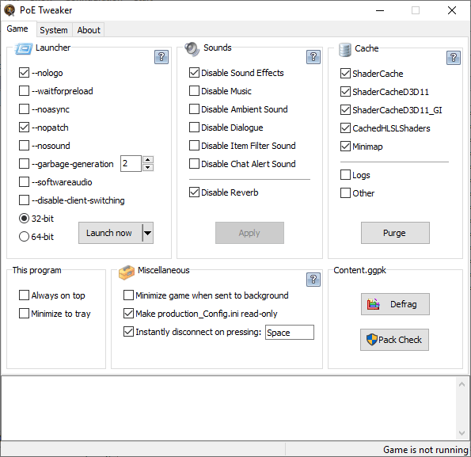

# PoE Tweaker

Fine-tuning utility for the game Path of Exile, featuring performance tweaks coming from community efforts in attempt to make this game run smoother. Contains some extra performance boosting features, known from paid utilities heavily advertised on Steam (but completely FREE). Programmed to be as easy to use as possible. Just set and forget!

**Download:** [Latest release](https://github.com/chris-wolcen/PoE-Tweaker/releases/latest)  
**VirusTotal:** [Scan](https://www.virustotal.com/gui/file/7a52ba5c337fb35ccd9388637c4f62c11fc87ccd0bb96c5ada0a76ace6469723/detection)

### Preview

### Program features

#### Launcher
Handy function allowing to quickly launch the game with different sets of command line parameters.  
Also allows to create a desktop shortcut with selected set of parameters.

#### Drop Rights
Allows to run the game without Administrator privileges (works with desktop shortcut creation too!).  
This method utilizes WinAPI functions to create a process with restricted (Normal User) token.  
While running in this mode, the game will be denied (by the OS) from interacting with elevated processes.

#### Sounds
Allows to actually DISABLE (not only mute) selected sounds.   
This can reduce CPU load and improve overall performance.

#### Cache
Allows to purge selected Shader Cache folders.   
According to players, purging Shader Cache helps to reduce stuttering.

#### Defrag
Allows to "defrag" game data file, by rebuilding it and removing obsolete entries.   
Can reduce file size up to few gigabytes. Said to improve load times.

#### Power Settings
Allows to throttle CPU state by adjusting Windows Power Management settings.  
Limiting "Maximum processor state" by few percent off, can be helpful in case of "CPU" hogging" issue and prevent CPU overheating.

#### CPU Affinity
Allows to assign less (or more) CPU resources to the game.  
Limiting cores available to the game, can help with freezes related to "CPU hogging" issue.  
Additional feature to move other processes to unused cores, can yield an extra performance boost.  
These settings are preserved and applied automatically every time the game starts (as long as this program is running).  
 
#### Memory
Monitors Path of Exile memory usage. Allows to force the game to release memory if it has consumed too much.   
Helpful in case of memory leaks, especially on low memory systems. Use with caution!

#### Miscellaneous
* Minimize game when sent to background  
  Helps to save CPU/GPU usage when Alt-Tabbed. Only works if this program is running.
* Make production_Config.ini read-only  
  Prevents overwriting game settings by ingame Options menu.
* Instantly disconnect on pressing a hotkey  
  Causes an instant logout by dropping all TCP connections of the game. Useful for HC. 

More features coming in next release...

### Download

**Download:** [Latest release](https://github.com/chris-wolcen/PoE-Tweaker/releases/latest)

#### System requirements
Windows 7, 8.1, 10 x86/x64. No depedencies*.  
*\* .NET Framework only required for LibGGPK.dll (defrag functionality) to work, though you should already have it in your Win10*

#### Installation
Extract the archive and run.  

#### License
Freeware

### FAQ

**Q: Is it open source?**  
A: Not for now, mainly due to the effort it took to implement extra features you'd otherwise have to pay for (known from paid utilities heavily advertised on Steam: CPU***** / Clear***). Writing the memory freeing function even involved some reverse engineering (to rip RAMMap features). However, I herein oblige to release the source code as soon as I lose interest in developing this program (or playing the game), so someone else could continue from that point.    

**Q: Can I get banned for using it?**  
A: No. This program is created to be ToS friendly (and I'm familiar with them).  
It doesn't do anything that's against the ToS of Path of Exile.
